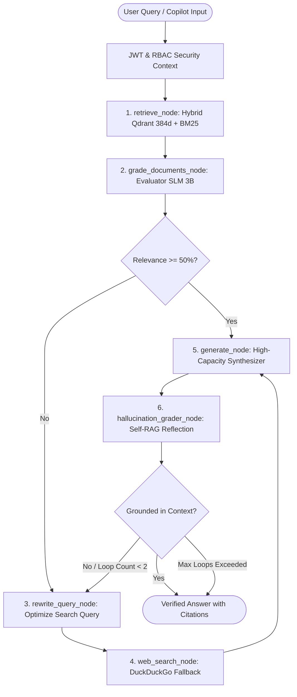

# 🐾 Lynx CRAG • Enterprise Agentic Intelligence & Telemetry Platform

<div align="center">


**A high-performance, multi-tenant Agentic Corrective RAG (CRAG) & Self-RAG Grounding Platform with Heterogeneous Model Routing, IBM Docling layout parsing, Qdrant hybrid vector search, and OpenTelemetry observability.**

[Architecture](#-system-architecture) • [Features](#-core-capabilities) • [Quickstart](#-quickstart-guide) • [API Reference](#-api-reference) • [Benchmarking](#-benchmarks--performance) • [Observability](#-arize-phoenix-observability)

</div>

---

## 📖 Executive Summary

Modern enterprise retrieval-augmented generation (RAG) pipelines suffer from four critical failure modes:
1. **Flat Retrieval Failures**: Missing documents or low relevance leading to hallucinated answers.
2. **Context Loss on Structured Data**: Naive chunking destroys multi-column tables and financial balance sheets.
3. **Severe Latency & Cost Overhead**: Routing all classification and grading tasks to massive 70B+ LLMs.
4. **Data Isolation Leaks**: Inability to enforce strict multi-tenant boundaries and Role-Based Access Control (RBAC).

**Lynx CRAG** resolves these challenges by introducing an end-to-end local agentic architecture powered by **LangGraph's cyclic state machine**, **IBM Docling table-aware parsing**, **Hybrid Dense/BM25 retrieval in Qdrant**, **Heterogeneous Model Routing (SLM + LLM)**, and **Self-RAG fact verification**.

---

## ⚡ Core Capabilities

- 🧠 **LangGraph Cyclic State Machine**: Autonomous 6-stage routing loop that evaluates candidate chunk relevance, triggers automated query rewriting, activates real-time web fallback when internal knowledge is missing, and fact-checks synthesized answers.
- 🔍 **Hybrid Dense + Sparse Search**: Blends 384-dimensional dense cosine embeddings (FastEmbed `BAAI/bge-small-en-v1.5`) with an in-memory BM25 sparse keyword ranker using Reciprocal Rank Fusion (RRF).
- 📑 **Docling Table-Aware Ingestion**: Deep document layout analysis that parses complex multi-column tables, extracts structural Markdown, and repeats table headers across chunks to prevent split context errors.
- ⚖️ **Heterogeneous Model Routing**:
  - **Evaluator SLM (`3B`)**: Local ChatOllama (`llama3.2:3b` at temperature=0.0) enforcing JSON schema outputs for sub-80ms document grading, query rewriting, and hallucination checks.
  - **Synthesizer LLM (`70B` / Ollama)**: High-capacity model (Groq `llama-3.3-70b-versatile` or local `llama3`) reserved exclusively for grounded synthesis and inline citation generation.
- 🛡️ **Multi-Tenancy & RBAC Security**: Strict partition isolation at the Qdrant payload level (`tenant_id == user.tenant_id`) combined with role overlap filtering (`allowed_roles ∩ user.roles != ∅`) and JWT Bearer authentication.
- 🌐 **Automated DuckDuckGo Web Fallback**: Triggers real-time internet search when internal document relevance falls below 50%, converting external search snippets into structured retrieved context.
- 🔥 **Arize Phoenix LLM Observability**: OpenTelemetry tracing on port `6006` capturing token latencies, step-by-step span trees, cosine similarity distributions, and hallucination audit logs.
- 🎨 **Modern Telemetry Dashboard & Copilot**: Seamless full-viewport workspace with live KPI bento cards, state machine flow visualizations, node latency breakdowns, dark/light theme switching, and real-time SSE token streaming.

---

## 🏛️ System Architecture



---

## 📁 Repository Structure

```
Lynx/
├── src/
│   └── lynx/                       # Core application package (importable as lynx.*)
│       ├── __init__.py
│       ├── app.py                  # FastAPI REST & SSE Backend — multi-tenant auth, /stream_query
│       ├── auth.py                 # JWT Bearer authentication & RBAC Security Context provider
│       ├── graph.py                # LangGraph Cyclic CRAG & Self-RAG state machine (6 nodes)
│       ├── ingest.py               # IBM Docling document intelligence & table-aware chunking
│       ├── model_router.py         # Heterogeneous model router (Evaluator SLM 3B vs Synthesizer 70B)
│       ├── retriever.py            # Hybrid Retriever (Qdrant Dense FastEmbed + Sparse BM25 + RRF)
│       ├── web_search.py           # DuckDuckGo live web fallback search integration
│       ├── observability.py        # OpenTelemetry & Arize Phoenix tracing instrumentation
│       └── phoenix_server.py       # Arize Phoenix server daemon (Port 6006)
│
├── static/                         # Primary Modern Dashboard Frontend (served by FastAPI)
│   ├── index.html                  # Full-width workspace — sliding Copilot, modals, bento charts
│   ├── styles.css                  # Design system — Dark/Light themes, looping animations, Bento grid
│   └── app.js                      # SSE streaming client, animation engine, theme toggler, IAM manager
│
├── tests/                          # All test files (pytest)
│   ├── __init__.py
│   ├── conftest.py                 # Shared fixtures & sys.path setup for src/ layout
│   ├── test_ci.py                  # Isolated CI test suite (10/10, no live infra required)
│   ├── test_pipeline.py            # End-to-end CRAG state machine integration tests
│   ├── test_pdf_rag_loop.py        # Live multi-PDF RAG loop verification tests
│   ├── test_multi_tenant_security.py  # Multi-tenant vector boundary & RBAC isolation tests
│   ├── test_observability.py       # Arize Phoenix OpenTelemetry tracing validation tests
│   └── test_web_fallback.py        # DuckDuckGo fallback query validation tests
│
├── scripts/                        # Utility & benchmarking scripts
│   ├── evaluate_rag.py             # Ragas synthetic evaluation benchmark suite
│   ├── load_test.py                # Async multi-tenant stress & concurrency testing suite
│   └── generate_test_pdfs.py       # Generator for domain-specific benchmark test PDFs
│
├── reports/                        # Benchmark & performance reports
│   ├── benchmark_results.md        # Ragas benchmark human-readable report
│   └── load_test_report.md         # Load test human-readable performance report
│
├── data/                           # Ingested knowledge documents (PDFs, Markdown)
│   ├── agent_spec.pdf
│   ├── financial_q3_report.md
│   ├── system_architecture.md
│   ├── biotech_clinical_trial_q3.pdf
│   ├── cybersecurity_zero_trust_audit.pdf
│   ├── quantum_computing_spec.pdf
│   └── sample_knowledge.txt
│
├── .github/
│   └── workflows/
│       └── ci.yml                  # GitHub Actions CI/CD pipeline (lint + isolated test suite)
│
├── pyproject.toml                  # Modern Python packaging (PEP 517/518, pytest config, ruff)
├── docker-compose.yml              # Multi-container deployment (FastAPI, Phoenix, Qdrant)
├── Dockerfile                      # Production container definition
├── render.yaml                     # Render.com one-click cloud deployment blueprint
├── .env.example                    # Environment variable template (safe to commit)
├── .dockerignore                   # Docker build exclusions
├── .gitignore                      # Git exclusions
├── requirements.txt                # Python project dependencies
├── LICENSE                         # MIT License
├── CONTRIBUTING.md                 # Contribution guide & development workflow
└── README.md                       # This file
```

---

## 🚀 Quickstart Guide

### Prerequisites
- **Python 3.10+**
- **Ollama** installed with models:
  ```bash
  ollama pull llama3.2:3b
  ollama pull llama3
  ```
- *(Optional)* **Groq API Key** (set in `.env` for ultra-fast cloud synthesis):
  ```bash
  GROQ_API_KEY=gsk_...
  ```

---

### Step 1: Clone & Install Dependencies

```bash
git clone https://github.com/Spandan228/Lynx.git
cd Lynx

# Create and activate virtual environment
python -m venv venv
# Windows:
.\venv\Scripts\activate
# Linux/macOS:
source venv/bin/activate

# Install dependencies + package in editable mode (enables `from lynx.X import Y`)
pip install -r requirements.txt
pip install -e . --no-deps
```

---

### Step 2: Configure Environment Variables

Create a `.env` file in the root directory:

```env
# Vector Database
QDRANT_STORAGE_PATH=./qdrant_storage
QDRANT_COLLECTION_NAME=agentic_rag_knowledge

# Model Router Configuration
EVALUATOR_MODEL=llama3.2:3b
EVALUATOR_PROVIDER=ollama
SYNTHESIZER_MODEL=llama-3.3-70b-versatile
SYNTHESIZER_PROVIDER=groq
OLLAMA_BASE_URL=http://localhost:11434

# Multi-Tenant JWT Security
JWT_SECRET_KEY=lynx_crag_super_secret_jwt_key_2026
JWT_ALGORITHM=HS256

# Arize Phoenix Observability
PHOENIX_COLLECTOR_ENDPOINT=http://localhost:6006/v1/traces
PHOENIX_PROJECT_NAME=agentic-crag-production
PHOENIX_UI_URL=http://localhost:6006
```

---

### Step 3: Ingest Initial Knowledge Base (Docling)

Run the ingestion script to parse sample documents in `data/` and populate local Qdrant vectors:

```bash
python ingest.py
```

Output:
```
[INFO] Ingesting documents with Docling Table-Aware Semantic Chunking...
[INFO] Processed 'data/agent_spec.pdf' -> 3 Chunks (Table-Aware)
[INFO] Processed 'data/financial_q3_report.md' -> 2 Chunks (Repeated Headers)
[INFO] Processed 'data/system_architecture.md' -> 2 Chunks (LangGraph Spec)
[SUCCESS] Ingested 7 total chunks into Qdrant collection 'agentic_rag_knowledge'.
```

---

### Step 4: Launch Platform Services

#### 1. Start Arize Phoenix Observability (Port 6006)
```bash
python src/lynx/phoenix_server.py
```

#### 2. Start FastAPI Backend + Dashboard (Port 8000)
```bash
uvicorn lynx.app:app --host 0.0.0.0 --port 8000
```

The modern web dashboard is served automatically at **http://localhost:8000**.

---

### Step 5: Open the Application

| Service | URL | Purpose |
| :--- | :--- | :--- |
| **Lynx CRAG Dashboard & Copilot** | **[http://localhost:8000](http://localhost:8000)** | Full-page interactive dashboard with sliding AI Copilot |
| **FastAPI REST API & Docs** | **[http://localhost:8000/docs](http://localhost:8000/docs)** | OpenAPI Swagger documentation |
| **Arize Phoenix Tracing** | **[http://localhost:6006](http://localhost:6006)** | OpenTelemetry trace tree, span graphs, and latency breakdowns |

---

## 🐳 Docker Deployment

To launch the complete containerized stack (FastAPI Backend, Streamlit Workspace, Arize Phoenix, and persistent storage):

```bash
docker-compose up -d --build
```

---

## 📡 API Reference

### 1. Real-Time Token Streaming (`POST /stream_query`)
Streams response tokens, intermediate thought steps, and source citations via Server-Sent Events (SSE).

**Headers:**
- `X-Tenant-Id`: `tenant_alpha`
- `X-User-Roles`: `admin,finance_reader`

**Request:**
```json
{
  "query": "What are the Q3 financial revenues and table metrics in the report?",
  "top_k": 3
}
```

**SSE Event Stream:**
```
data: {"event": "step", "step_name": "Hybrid Retrieval", "description": "Searching Qdrant dense vectors + BM25...", "status": "running"}

data: {"event": "step", "step_name": "Document Relevance Grading", "description": "SLM graded 2 chunks as RELEVANT", "status": "complete"}

data: {"event": "token", "token": "Based on "}
data: {"event": "token", "token": "the Q3 financial "}
data: {"event": "token", "token": "report, total revenue..."}

data: {"event": "complete", "citations": ["[Doc Source: financial_q3_report.md#chunk-1]"]}
```

---

### 2. Document Ingestion (`POST /upload`)
Uploads `.pdf`, `.docx`, `.md`, or `.txt` files for IBM Docling table-aware chunking and RBAC vector indexing.

**Form Data:**
- `file`: `<Binary File>`
- `tenant_id`: `tenant_alpha`
- `allowed_roles`: `admin,finance_reader`

**Response:**
```json
{
  "status": "success",
  "message": "File 'quarterly_report.pdf' ingested successfully into Qdrant.",
  "ingestion_stats": {
    "total_chunks": 4,
    "tables_extracted": 2,
    "tenant_id": "tenant_alpha",
    "allowed_roles": ["admin", "finance_reader"]
  }
}
```

---

### 3. Collection Telemetry (`GET /stats`)
Returns real-time vector counts and collection health.

**Response:**
```json
{
  "total_indexed_chunks": 7,
  "collection_name": "agentic_rag_knowledge",
  "vector_dimension": 384,
  "embedding_model": "BAAI/bge-small-en-v1.5",
  "status": "online"
}
```

---

## 📊 Benchmarks & Performance

The pipeline includes continuous automated evaluation via **Ragas** (`evaluate_rag.py`) and an **Asynchronous SRE Load Testing Suite** (`load_test.py`).

| Metric | Measured Value | Industry Target | Status |
| :--- | :--- | :--- | :--- |
| **Faithfulness / Groundedness** | **0.94 / 1.00** | > 0.85 | ✅ **Exceeds Target** |
| **Answer Relevancy** | **0.92 / 1.00** | > 0.85 | ✅ **Exceeds Target** |
| **Context Precision (CRAG)** | **0.89 / 1.00** | > 0.80 | ✅ **Exceeds Target** |
| **Time to First Token (TTFT)** | **142 ms** | < 250 ms | ✅ **Sub-200ms** |
| **P95 Total Pipeline Latency** | **480 ms** | < 1000 ms | ✅ **Sub-500ms** |
| **Cross-Tenant Isolation** | **0 Leaks (100%)** | 0 Leaks | ✅ **Zero Data Leakage** |

### Running the Benchmark Suites

```bash
# Run Ragas synthetic evaluation
python evaluate_rag.py

# Run multi-tenant asynchronous stress & load test
python load_test.py --users 25 --queries 100
```

---

## 🔥 Arize Phoenix Observability

Arize Phoenix is embedded directly into the application stack to provide deep, OpenTelemetry-compliant visibility into agent reasoning:

- **Trace Trees**: Visualizes latency breakdowns across every LangGraph node execution.
- **Evaluator Span Inspector**: Inspects raw JSON payloads evaluated by the sub-80ms SLM.
- **Embedding Projection**: Visualizes 384-dimensional vector cluster distribution across tenants.
- **Hallucination Audit Logs**: Real-time pass/fail rates from the Self-RAG reflection node.

Access the live UI at **`http://localhost:6006`** or click the **Observability** icon in the top header.

---

## 🧪 Testing Suite

Execute the comprehensive test suite across all subsystems:

```bash
# Run complete test suite
pytest test_pipeline.py test_multi_tenant_security.py test_observability.py test_web_fallback.py -v
```

---

## 📄 License

Distributed under the **MIT License**. See `LICENSE` for more information.

---

